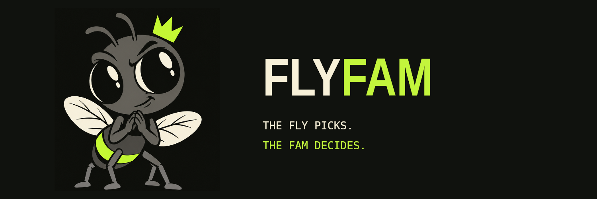
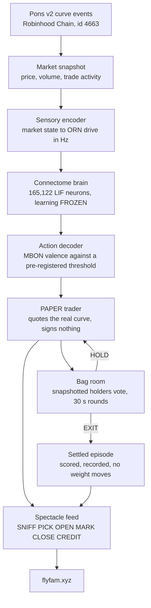

<p align="center">
  
</p>

<p align="center">
  <b>A fruit-fly connectome, simulated neuron by neuron, trading Pons v2 memecoins on paper —
  while token holders vote every position out.</b>
</p>

<p align="center">
  <a href="#quickstart"></a>
  <a href="https://github.com/maumcrez-svg/flyfam/actions/workflows/tests.yml"></a>
  <a href="#what-is-live-and-what-is-not"></a>
  <a href="#what-is-live-and-what-is-not"></a>
  <a href="#attribution-and-licences"></a>
  <a href="#attribution-and-licences"></a>
  <a href="NOTICE.md"></a>
</p>

<p align="center">
  <a href="https://flyfam.xyz">flyfam.xyz</a> ·
  <a href="https://flyfam.xyz/brand.html">brand kit</a> ·
  <a href="https://t.me/flyfamrh">Telegram</a> ·
  <a href="https://x.com/flyfamrh">X</a>
</p>

---

## What is FLYFAM

FLYFAM runs the FlyEM male *Drosophila* CNS connectome v1.0 — 165,122 traced neurons and
10,228,000 signed synaptic edges — as a leaky integrate-and-fire simulation, and wires its
output to a live market. Every thirty seconds the simulated fly looks at the memecoins
launched on Pons v2 (Robinhood Chain, chain id 4663), admits the ones that pass a fixed
filter, picks at most one, and opens a **paper** position. Nothing is signed, nothing is
broadcast, and no real money is at risk.

The fly chooses the entry. It does not choose the exit: holders of the project token are
snapshotted when a position opens and vote HOLD or EXIT in thirty-second rounds until the
bag closes. That is the bag room, and it is the product.

The brain is frozen. It learned in a series of pre-registered experiments, those
experiments are in this repository with their protocols committed before their results,
and the honest reading of them is in [The science](#the-science) below: the anatomy and
the plasticity reproduce, the trading edge does not. **Nothing here is evidence of skill
at trading, and nothing in this repository claims otherwise.**

## How it works



Each stage is a separate, versioned module with its own document and its own tests. The
seam between the connectome simulator we reuse and the market machinery we built is drawn
explicitly in [`docs/ARCHITECTURE.md`](docs/ARCHITECTURE.md).

## The science

**The connectome.** The graph build is anatomy-first. It produces three matrices over one
shared body index, all `[post, pre]` — row is postsynaptic, column is presynaptic:
`graph_anat.npz` (unsigned synapse counts), `graph.npz` (signed fast weights, 10,228,000
edges) and `graph_mod.npz` (dopaminergic counts, never given a fast weight). Every
population is counted off the dataset rather than quoted from a paper, split into what
the data shows, what the literature says, and what we chose — see
[`docs/POPULATIONS.md`](docs/POPULATIONS.md).

**The mushroom-body fix.** Upstream classifies PAM / PPL1 compartments from MBON→DAN
feedback — a transposed read of its own `[post, pre]` convention. Against the shipped
graph the *documented* read returns nothing at all, because dopaminergic edges are signed
`0.0` and dropped, which is why the transposed one shipped. Our `flytrade/mushroom.py`
reads `D[mbon][:, dan].sum(axis=1)`: the dopaminergic synapses each MBON actually
*receives*. On MaleCNS v1.0 the corrected split is 24,005 / 20,037 PAM / PPL1-side KC→MBON
synapses, against upstream's 27,939 / 14,349, and MBON01–10 land PAM-side with MBON11–15
PPL1-side, matching the hemibrain compartment map. `upstream/` is vendored **untouched**;
the fix lives only in our code, and two strict xfails pin the upstream defect so it cannot
be silently "fixed" away. See [`docs/UPSTREAM_NOTES.md`](docs/UPSTREAM_NOTES.md) and the
standalone minimal repro at
[flysim-mushroom-fix](https://github.com/maumcrez-svg/flysim-mushroom-fix).

**Conditioning.** With the fix in place, a pre-registered associative-conditioning
experiment asked whether pairing an odour with reinforcement changes the later neural
response to that odour. The primary metric was negative in 8 of 8 seeds (one-sided sign
test, p = 0.035), mean effect −24.777 Hz, with the plasticity-off control moving no
synapse at all. Verdict **PASS** against the decision rule fixed before the run. This is a
neuroscience result about the mushroom body. It says nothing about markets. Protocol and
results: [`experiments/conditioning/`](experiments/conditioning/).

**The decoder was pre-registered before any PnL existed.** It reads the centred valence
`approach − avoid` over MBON01–MBON15 — 16 PPL1-innervated and 29 PAM-innervated neurons,
with the other 52 MBONs excluded rather than guessed — and compares it against
θ = 3.241438 Hz, one measured baseline standard deviation. Saturation is checked first,
then silence, then the margin; anything inside the margin is `WAIT`. θ is an
action-decoding rule, not a probability of financial success. See
[`docs/DECODER.md`](docs/DECODER.md).

**What the record actually says.** D7's pre-registered readout put context ranking at
chance in both branches (AUC 0.4904 trained, 0.4934 reference). D11 and D12 closed
**INCONCLUSIVE** by their own pre-registered conditions. On 2026-09-13 the decision was
to stop the scientific track, freeze the brain and run the Pons loop as spectacle. The
product artifact is `brains/trader-v1/brain.npz`, digest `ba95b605…`, every plastic
KC→MBON gain at 1.0, and the product loop applies no plasticity: a settled episode becomes
a CREDIT event with `applied: false` and changes no weight.

## The bag room

The fly picks. The fam decides.

- **One wallet, one vote.** Eligibility is a snapshot of on-chain token balances taken when
  the bag opens, and that snapshot is **immutable for the life of the bag** — buying in
  afterwards does not buy a vote in it.
- **Rounds of 30 seconds.** Votes are tallied at the end of each round and the round is
  finalised transactionally into a hash-linked audit journal.
- **No quorum.** A round with a single voter is a valid round.
- **Ties EXIT.** One EXIT with no HOLD closes the bag. The conservative side wins.
- **A pending vote pauses everything**, the automatic fallbacks included.
- **The excluded are named, never guessed.** Exclusions — the bonding curve, infrastructure
  wallets — are an explicit configured list. There are no automatic router, factory, pool or
  contract-wallet filters.

Automatic exit exists only as a PAPER / test-holder fallback, on **gross** return bands
(±20%), 600 s of market silence and a 3600 s maximum hold. Gross, because a round trip on
these curves costs 2.5–8.6% of notional and the old net stop was measuring its own costs.
Net is still computed and displayed, and decides nothing. See
[`docs/BAG_ROOM.md`](docs/BAG_ROOM.md) and [`docs/AUTO_EXIT.md`](docs/AUTO_EXIT.md).

## What is live and what is not

| | |
|---|---|
| Real Pons v2 market data, read over RPC | **yes** |
| Paper execution against the real bonding curve | **yes** |
| Holder-voted exits, real on-chain holders | **yes** |
| Public spectacle feed and site | **yes** |
| Signing or broadcasting any transaction | **no** — the chain package has a six-method read-only allowlist and holds no key material |
| Real claims or payouts | **no** — the claim endpoints return an empty list and the vault reports itself unconfigured |
| Creator-fee split | **no** — the facts are recorded, the worker is not written |
| Real money at risk | **no** |
| Any claim of profitability or edge | **no** |

## Quickstart

Python 3.13, on upstream's own pins (`pyproject.toml`: numpy 2.4.2, scipy 1.17.1,
pandas 3.0.1, pyarrow 23.0.1, pytest 9.1.1).

```sh
git clone https://github.com/maumcrez-svg/flyfam.git
cd flyfam
python3.13 -m venv .venv
.venv/bin/pip install -e '.[dev]'
```

### Run the tests

These six suites run on a clean clone with **no connectome download, no network and no
credentials**, on synthetic graphs built for the purpose:

```sh
.venv/bin/python -m pytest tests/core tests/upstream_audit tests/phase_one \
                          tests/k8_readout tests/d7 tests/historical
# 305 passed, 74 skipped, 2 xfailed
```

The 74 skips are the suites that self-skip when the connectome is absent. The 2 xfails are
the strict pins of the upstream defect and **must not** be made to pass. The upstream audit
alone, which is the shortest interesting thing to run:

```sh
.venv/bin/python -m pytest tests/upstream_audit
```

The remaining suites are **not** expected to pass on a clean clone of this snapshot, and
this is by design rather than neglect:

| suite | what it additionally needs |
|---|---|
| `tests/bags`, `tests/product`, `tests/d11` | the production runtime — an RPC endpoint in a local `.env`, and the live service environment |
| `tests/d8`, `tests/d9b` | row files derived from market data licensed for internal use only; they are not redistributed |
| `tests/d10`, `tests/d12` | the full commit history, which proves each protocol was committed *before* its run. This repository is a curated single-commit snapshot, so those hygiene tests cannot see it; the history lives in the private mirror |
| `tests/observer` | run directories that are gitignored experiment state |

Suites that read the real connectome need the three feather files downloaded first. They
are not in this repository; [`data/MANIFEST.md`](data/MANIFEST.md) records the source URLs,
byte sizes and sha256 so the download is reproducible.

### Run the experiment viewer

A stdlib, loopback-only, read-only server over the recorded experiment runs:

```sh
.venv/bin/python observer/serve.py     # http://127.0.0.1:8765/
```

The public product is the site at [flyfam.xyz](https://flyfam.xyz). Its front end is
`spectacle/` in this tree; it reads a live feed directory that a running trader produces,
so it has nothing to show on a clean clone.

## Repository layout

```
flytrade/      our code: graph build, sensory encoder, mushroom-body fix, action decoder,
               Pons client and curve port, paper execution, product loop, bag room
brains/        the frozen product artifact trader-v1/brain.npz and its manifest
spectacle/     the public site: a stdlib http.server, browser-native JS and CSS,
               an original animated fly, no build step and no external assets
product/       the freeze tool, the runners and the example configs for the Pons loop
observer/      the read-only event viewer over recorded experiment runs
contracts/     HolderVault and the Pons v4 exit helper, Solidity
experiments/   pre-registered experiments D1-D12: protocol, plan and config committed
               before any number existed; results and reports alongside them
docs/          architecture, upstream audit, populations, encoder, decoder, execution,
               the canonical spec, the feed contract, the bag room
tests/         pytest suites, including tests/upstream_audit which pins upstream's
               verified behaviour and its one defect
upstream/      fruitflydev/flycoinrh vendored at 5aab4e78, MIT, unmodified,
               byte-pinned by docs/UPSTREAM_MANIFEST.txt
art/           character and brand source
data/          gitignored runtime, connectome and market data; only data/MANIFEST.md
               is committed
```

## Documentation

| document | what it covers |
|---|---|
| [`docs/ARCHITECTURE.md`](docs/ARCHITECTURE.md) | the upstream seam, the three matrices, the plasticity fix, the operating point, per wave |
| [`docs/UPSTREAM_NOTES.md`](docs/UPSTREAM_NOTES.md) | the Phase Zero audit of flycoinrh: verified, transposed, and unverifiable |
| [`docs/POPULATIONS.md`](docs/POPULATIONS.md) | every population counted off the dataset, split into observed connectivity, literature interpretation and our modelling rule |
| [`docs/ENCODER.md`](docs/ENCODER.md) | market state to ORN drive, and why the normalisation is what it is |
| [`docs/DECODER.md`](docs/DECODER.md) | the pre-registered readout: populations, aggregation, θ, the four statuses, the tie rule |
| [`docs/EXECUTION.md`](docs/EXECUTION.md) | the paper execution model and its costs |
| [`docs/BAG_ROOM.md`](docs/BAG_ROOM.md) | holder-controlled exits: eligibility, rounds, the vote rule, the audit journal |
| [`docs/AUTO_EXIT.md`](docs/AUTO_EXIT.md) | the PAPER fallback, and why the net basis was replaced by gross |
| [`docs/SPECTACLE_FEED.md`](docs/SPECTACLE_FEED.md) | the feed contract the front end reads, key by key |
| [`docs/PRODUCT_V1.md`](docs/PRODUCT_V1.md), [`docs/FRONTEND_V1.md`](docs/FRONTEND_V1.md), [`docs/HOLDER_ACCESS.md`](docs/HOLDER_ACCESS.md) | the public product surface |
| [`docs/SPEC.md`](docs/SPEC.md) | the canonical specification, every amendment and every reviewer addendum |
| [`docs/UPSTREAM_MANIFEST.txt`](docs/UPSTREAM_MANIFEST.txt) | commit, tree hash and every blob hash of the vendored upstream |
| [`CHANGELOG.md`](CHANGELOG.md) | dates and what shipped |
| [`CONTRIBUTING.md`](CONTRIBUTING.md) | how to run the tests, the rules that are not negotiable, what a PR needs |
| [`SECURITY.md`](SECURITY.md) | how to report something, and what is out of scope |

## Attribution and licences

- **Connectome** — FlyEM male *Drosophila* CNS v1.0, © HHMI Janelia FlyEM, the Cambridge
  Connectomics Group and Google Research, **CC-BY 4.0**. The data files are **not** in this
  repository; [`data/MANIFEST.md`](data/MANIFEST.md) records source URLs, byte sizes and
  sha256 so the download is reproducible. The attribution obligation travels with every
  derived artifact — a built graph and any public figure included.
- **`upstream/`** — [fruitflydev/flycoinrh](https://github.com/fruitflydev/flycoinrh) at
  `5aab4e7895a1f5930319bf3bde8010b350a163a2`, **MIT**, © 2026 fruitflydev. Vendored
  verbatim with its own `LICENSE` and `NOTICE`, and byte-pinned. No upstream file is
  modified anywhere in this tree.
- **Pons contracts** — the frozen Sourcify copies under `experiments/d10/evidence/` are
  **MIT**, © the Pons authors. `PonsTickMath.sol` is GPL-2.0-or-later and is **not** used,
  copied, ported or linked here.
- **Third-party assets** — fonts and the vendored Three.js carry their own licence files
  next to them under `spectacle/static/`.
- **Our code** — © 2026 FLYFAM. All rights reserved. No open-source grant is offered yet;
  read, audit and cite it freely, and ask before redistributing.
- Simulation approach after Shiu et al. 2024 and Lappalainen et al. 2024.

Full text in [`NOTICE.md`](NOTICE.md). FLYFAM is not affiliated with HHMI Janelia, the
Cambridge Connectomics Group, Google Research, Pons, Robinhood or Uniswap.

No private key, environment file or credential is tracked in this repository.

## Community

- Site — [flyfam.xyz](https://flyfam.xyz) · brand kit — [flyfam.xyz/brand.html](https://flyfam.xyz/brand.html)
- Telegram — [t.me/flyfamrh](https://t.me/flyfamrh)
- X — [x.com/flyfamrh](https://x.com/flyfamrh)
- Bugs and questions — [open an issue](https://github.com/maumcrez-svg/flyfam/issues)

## Disclaimer

Nothing in this repository is financial advice, an offer, a solicitation or a prediction.
Trading here is **paper trading**: no transaction is signed or broadcast and no real money
is at risk. Memecoins are extremely high-risk assets and most of them go to zero. A
simulated fruit-fly brain is not a trading system, and no result in this repository —
past, present or displayed live — should be read as evidence that it can make money. Do
your own research, and never risk what you cannot lose.
